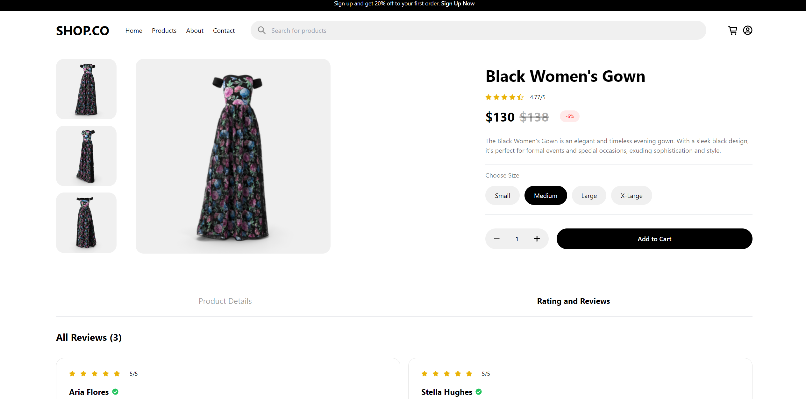
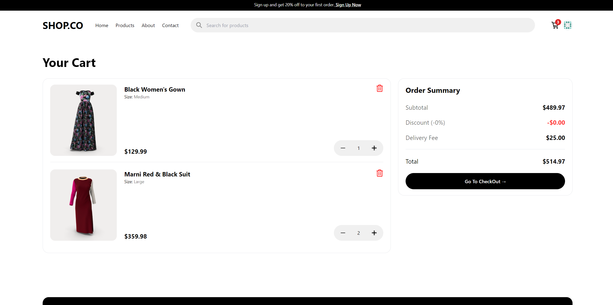

# eShop

This repository contains **eShop**, a modern and fully-featured e-commerce platform designed to provide a seamless shopping experience. It offers dynamic product listings, advanced filtering, a fully functional cart system, and a responsive design, making it easy to shop across devices.





## Features

- **Product Listings:** Browse through a variety of products across multiple categories with rich details and images.
- **Advanced Filtering:** Easily filter products by categories, price range, and more to find what you need quickly.
- **Shopping Cart:** Add items to the cart, adjust quantities, and manage your order before proceeding to checkout.
- **User Authentication:** Secure login functionality allowing users to manage their accounts and view order history.
- **Responsive Design:** Optimized for all screen sizes, from mobile phones to desktop devices, ensuring a smooth experience.
  
## API Integration

eShop integrates with external APIs to provide up-to-date product listings, secure user authentication, and smooth order handling.

## Technologies Used

- **React:** For building interactive user interfaces.
- **Vite:** For fast development and optimized builds.
- **Tailwind CSS:** Utility-first CSS framework for rapid UI development.
- **Redux:** State management for cart, authentication, and product filtering.
- **React Router:** Handles client-side routing.
- **Axios:** Handles API requests for fetching product and user data.
- **Local Storage:** For persisting cart and user data between sessions.
- **js-cookie:** Manages user sessions and stores authentication tokens in cookies for improved security.
- **ESLint:** Ensures code quality and consistency.

## Installation

To run this project locally, follow these steps:

1. **Clone the Repository:**

    ```bash
    git clone https://github.com/ahmedkamal14/eShop.git
    cd eShop
    ```

2. **Install Dependencies:**

    ```bash
    npm install
    ```

3. **Run the Development Server:**

    ```bash
    npm run dev
    ```

## API Configuration

The application fetches data from [DummyJSON](https://dummyjson.com). No further configuration is required for development since the API is publicly accessible.

## How It Works

- **API Integration:** The app uses the DummyJSON API to fetch product and user data. This enables dynamic product search and secure user authentication.
- **User Authentication:** Users can securely log in, manage their account, and track their orders. The authentication process is managed by the DummyJSON API.
- **Responsive Design:** The layout adjusts smoothly across various screen sizes, providing an optimal experience whether on mobile or desktop.

## Deployment

This project is deployed on GitHub Pages. You can view the live site at: [eShop](https://ahmedkamal14.github.io/eShop/).

## Contribution

Contributions are welcome! Feel free to fork this repository, submit issues, or create pull requests. All feedback and improvements are appreciated.
